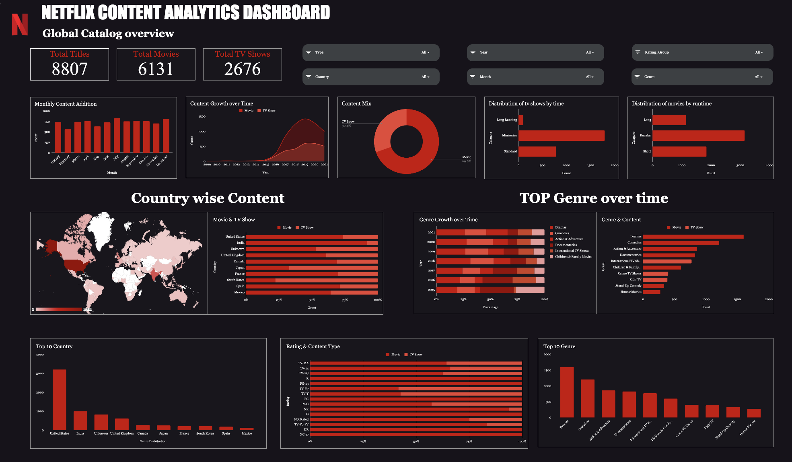

# Global OTT Content Strategy Insights (Netflix)

**Project Dashboard**: [Google Sheets Dashboard](https://docs.google.com/spreadsheets/d/1SMpBtLsXCCp8xcQMGcVWLMj3ZAVPsS9tGXdQLPJb8Wc/edit?usp=sharing)
**GitHub Repository**: [Project Logic & Analysis Code](https://github.com/MAYANKSHARMA01010/SectionA_G-11_Global_OTT_Content_Strategy_Insights)

## Project Overview

This project analyzes the Netflix Movies and TV Shows dataset (8,808 titles) to uncover strategic insights into content distribution, growth trends, and audience segmentation. The objective is to guide future content investment decisions by understanding structural patterns in the catalog.

Key findings indicate a movie-heavy catalog (~70%), significant dominance of the Drama genre, and strong geographic concentration in the United States. The analysis also highlights a shift from aggressive expansion to controlled growth after 2019.

## Dataset Analysis Screenshots

## File Details

The project is structured as follows:

-   **`RawDataset/`**: Contains the original, unprocessed dataset (`raw_dataset.csv`).
-   **`Cleaned/`**: Contains the cleaned dataset (`cleaned_dataset.xlsx`) and data cleaning notes (`clean.md`).
-   **`Calculations_Pivots/`**: Stores intermediate calculations and pivot tables used for analysis.
-   **`Dashboard/`**: Contains the project dashboard image and related files.
-   **`Documentation/`**: Project Report (`Report.docx`) and other documentation.
-   **`Presentation/`**: Project Presentation (`Presentation.pdf`).
-   **`README.md`**: Project overview and documentation (this file).

## KPI & Metric Framework

The analysis utilizes specific Key Performance Indicators (KPIs) to convert raw metadata into actionable business insights:

| KPI | Description | Strategic Relevance |
| :--- | :--- | :--- |
| **Total Titles** | Total number of catalog entries (8,808). | Measures overall catalog size and scale. |
| **Content Type Mix** | Ratio of Movies (6,131) to TV Shows (2,676). | Evaluates format balance and investment focus. |
| **Genre Distribution** | Breakdown by `primary_genre`. | Identifies dominance (e.g., Drama) and diversification gaps. |
| **Country Contribution** | Breakdown by `primary_country`. | Assesses geographic concentration risk (e.g., US dominance). |
| **Rating Segmentation** | Grouped by Adults, Teens, Kids. | Measures audience targeting effectiveness. |
| **Yearly Growth Trend** | Count of titles added per year (`year_added`). | Tracks expansion velocity and strategic shifts. |
| **Content Lag** | Difference between `year_added` and `release_year`. | Evaluates content freshness and acquisition speed. |

## Data Dictionary

The analysis is based on the following key data points:

| Variable | Type | Description | Example |
| :--- | :--- | :--- | :--- |
| `show_id` | str | Unique ID for each title | s1 |
| `type` | str | Content Type (Movie or TV Show) | Movie |
| `title` | object | Title of the content | Dick Johnson Is Dead |
| `director` | str | Director of the content | Kirsten Johnson |
| `cast` | str | Main actors involved | (List of actors) |
| `country` | str | Country of origin | United States |
| `date_added` | datetime | Date added to Netflix | 2021-09-25 |
| `release_year` | int64 | Original release year | 2020 |
| `rating` | str | Content rating (e.g., TV-MA) | PG-13 |
| `duration` | str | Duration (minutes or seasons) | 90 min |
| `listed_in` | str | Genre categories | Documentaries |
| `description` | str | Brief synopsis | As her father nears... |

## Exploratory Data Analysis (EDA) Methodology

The project followed a structured EDA approach:

1.  **Trend Analysis**: Studied yearly addition rates to identify growth phases (e.g., rapid expansion 2016-2019).
2.  **Comparison Analysis**: Contrasted Movies vs. TV Shows across genres, ratings, and countries.
3.  **Distribution Analysis**: Visualized the spread of content by duration and release year to understand format structures.
4.  **Correlation Analysis**: Examined relationships between countries and dominant genres to spot regional specializations.

## Key Insights & Statistics

### Statistical Highlights
-   **Total Titles**: 8,807
-   **Movie vs TV Show**: Movies account for ~70% (6,131 titles) vs TV Shows ~30% (2,676 titles).
-   **Top Contributing Countries**:
    1.  United States
    2.  India
    3.  United Kingdom
    4.  Japan
    5.  South Korea
-   **Dominant Genres**:
    1.  Dramas (International Movies)
    2.  Documentaries
    3.  Stand-Up Comedy

### Strategic Observations
-   **Content Growth**: Content additions accelerated sharply after 2015, followed by stabilization, indicating a shift from aggressive expansion to controlled growth.
-   **Regional Focus**: The US is the primary content provider, but there is significant potential for international expansion.
-   **Audience Segmentation**: Adult-rated content (TV-MA) forms the largest segment.

## Analysis Suggestions

Based on the data, the following strategic actions are recommended:

1.  **Increase TV Show Investment**: Gradually raise the share of TV Shows to strengthen long-term engagement and retention.
2.  **Diversify Genre Portfolio**: Reduce over-reliance on Drama by expanding Thriller, Sci-Fi, Documentary, and Family categories.
3.  **Expand International Content**: Increase non-US production to reduce geographic concentration and appeal to global audiences.
4.  **Balance Rating Segmentation**: Expand Teen and Kids content to capture household subscriptions.

## Limitations

-   **Metadata Only**: The analysis is restricted to content attributes and does not include financial (revenue/cost) or engagement (views/watchtime) data. Impact assessments are structural, not performance-based.
-   **Time Period**: The dataset largely reflects titles added up to 2021, meaning recent strategic shifts may not be captured.
-   **Structural Patterns vs. Preference**: Findings (e.g., high Drama count) indicate supply-side structure, which may not perfectly align with demand-side audience preference without viewership data.

## Data Cleaning Notes

For details on how the data was cleaned and prepared, please refer to [Cleaned/clean.md](Cleaned/clean.md).
Key steps included handling missing values for `director`, `cast`, and `country`, and engineering features like `content_lag` and `duration_bin`.
